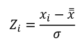

```{r message=FALSE, warning=FALSE, include=FALSE}
#pakiety użyte w projekcie
library(readr)
library(corrplot)
library(ggplot2)
library(kableExtra) #do ładnych tabelek
#install.packages("pROC")
library("pROC")

```

::: {style="text-align: justify"}
**CEL PRACY**

::: {style="text-align: justify"}
Zawartość tej pracy skupia się głównie na zastosowaniu metod Maching
Learningu, które zostaną wykorzystane do prognozowania, czy dany pacjent
ma chorobę serca. Wykonano i opisano zachowanie się danych stosując
następujące metody: **metodę KNN**, **klasyfikator naiwny Bayesa** oraz
**regresję logistyczną**. Zastosowanie tych metod zostało poprzedzone
wykonaniem wstępnej analizy danych, zbadaniem wpływu zmiennych
objaśniających na zmienną objaśnianą i odpowiednim przygotowaniem
danych.
:::

**OPIS DANYCH**

Dane wykorzystane w tym projekcie pochodzą z
[https://www.kaggle.com/](https://www.kaggle.com/datasets/fedesoriano/heart-failure-prediction?fbclid=IwAR0OHg9EyQpj4L8UXvmSf2oeEqfPWscchzXt00lChoVCKYmgZpaeHzHx5lw).[^1]
Składają się z 9 zmiennych i 918 obserwacji. Są to dane pacjentów, które
zostały wykorzystane do przewidywania wystąpienia chroby serca. Poniżej
opisano, co dokładanie charakteryzują poszczególne zmienne.[^2]

-   **Wiek**: wiek pacjenta [lata]

-   **Płeć**: płeć pacjenta [M: mężczyzna, F: kobieta]

-   **RestingBP**: ciśnienie spoczynkowe [mm Hg]

-   **Cholesterol**: cholesterol w surowicy [mm/dl]

-   **FastingBS**: poziom cukru we krwi na czczo [1: jeśli FastingBS \>
    120 mg / dl, 0: w przeciwnym razie]

-   **MaxHR**: maksymalne osiągnięte tętno [wartość liczbowa między 60 a
    202]

-   **Oldpeak**: oldpeak = ST [Wartość liczbowa mierzona w depresji]

-   **ExerciseAngina**: dławica piersiowa wywołana wysiłkiem [Y: Tak, N:
    Nie]

-   **HeartDisease**: klasa wyjściowa [1: choroba serca, 0: normalna
    (brak)]

**WPROWADZENIE**

Po wczytaniu danych sprawdzono jakiego typu są dane w celu wstępnego
rozpoznania. Funkcja **str()** pokazuje jakie kolumny są w zestawie
danych i jakiego typu są to wartości.

```{r echo=TRUE, results='hide', message=FALSE, warning=FALSE}
#wczytanie danych
dane <- read_csv("heart.csv")
structure <- str(dane)
```

Poniżej przedstawiono 5 początkowych wartości z zestawu danych przed
przystąpieniem do analizy.

```{r}
show <- head(dane)
kbl(show) %>%
  kable_classic(bootstrap_options = "striped", full_width = F)
```

Następnie usunięto dane tekstowe i dokonano zamiany wybranych zmiennych
kategorycznych na zmienne zero-jedynkowe, aby zapobieć utracie
kluczowych zmiennych.

```{r}
dane <- dane[,-c(3,7,11)] 
dane$Sex <- ifelse(dane$Sex== 'M', 1, 0)
dane$ExerciseAngina <- ifelse(dane$ExerciseAngina== 'Y', 1, 0) #Y-1=posiadanie dławicy wysiłkowej
# zamiana kolejnośći kolumn w celu przejrzystości
dane <- dane[, c(1, 3, 4, 6, 8,2,5,7,9)]
```

Poniższa tabela zawiera statystyki dotyczące badanego zestawu danych.

```{r}
statystyki <- summary(dane)
kbl(statystyki) %>%
  kable_classic(bootstrap_options = "striped", full_width = F)
```

Jak można zauważyć, dane są bardzo różnorodne. Minimalny wiek badanych
to 28 lat, a maksymalny to 77. Średnio każdy badany pacjent ma 53 lata,
z tego wynika, że najwięcej osób w tym wieku podejrzewa się o chorobę
serca. Informacje w tej tabeli niewiele mówią nam na temat płci,
ponieważ są to zmienne zero-jedynkowe, jednak można zauważyć, że skoro
średnia to 0,7898, a 1 - reprezentuje płeć męską, to w naszych danych
przeważają mężczyźni. RestingBP (ciśnienie spoczynkowe) jest w
przedziale od 80 mmHg do 200. Średnio ciśnienie wynosi 132,5 - czyli
delikatnie powyżej normy. Cholesterol mieści się w zakresie 85 mg/dl aż
do 603 mg/dl. Tak duża wartość może wynikać z indywidualnego przypadku
zdrowotnego. Średnia Fasting BP, czyli poziom cukru wynosi 0,2331, a z
uwagi na to, że to zmienna zero-jedynkowa i wartości 0 oznaczają poziom
cukru mniejszy od 120 mg / dl, a norma to 80--140 mg/dl, można uznać, że
większość badanych ma prawidłowy poziom cukru. MaxHR zawiera się w
przedziale od 60 do 202. Średnio badani mają tętno na poziomie 136,8.
ExerciseAngina, czyli dławica piersiowa wywołana wysiłkiem przyjmuje się
średnią 0,4 - czyli około 40% z 918 badanych jej doświadczyło. Wartości
Oldpeak (Wartość liczbowa mierzona w depresji) wahają się w od -2,6 do
6,2. Średnia HeartDisease wynosi 0,5534 - można stwierdzić, że rozkład
pacjentów z chorobą serca i bez choroby serca jest prawie równomierny,
lecz to pacjentów z chorobą serca jest więcej. Z tabeli wynika także, że
nie ma brakujących danych.

**MACIERZ KORELACJI**

Aby lepiej zapoznać się z danymi, wykonano macierz korelacji pomiędzy
zmiennymi wykorzystując korelację rang Kendalla.

```{r}
corr = cor(dane,method="kendall") #zmiana na kendalla
corrplot(corr, method="color", addCoef.col = "black")
```

```{r eval=FALSE, include=FALSE}
dane$Sex<-as.factor(dane$Sex)
dane$FastingBS<-as.factor(dane$FastingBS)
dane$HeartDisease<-as.factor(dane$HeartDisease)

dane$Cholesterol<-as.numeric(dane$Cholesterol)
dane$Age<-as.numeric(dane$Age)
dane$RestingBP<-as.numeric(dane$RestingBP)
dane$MaxHR<-as.numeric(dane$MaxHR)
```

Z wykresu wynika, że korelacja zmiennych ze zmienną prognozowaną
przyjmuje wartości od -0,09 do 0,49. Zmienna prognozowana największą
korelację ma ze zmienną ExerciseAngina, a najmniejszą (jak również
ujemną) ma ze zmienną Cholesterol.

### **ANALIZA WPŁYWU ZMIENNYCH NA ZMIENNĄ PROGNOZOWANĄ Y**

Wykonanie wykresów badających wpływ zmiennych na zmienna prognozowaną
Y.[^3]

```{r}
wykresy <- par( mfrow= c(1,2))
par(mar=c(5, 4, 2,6)+ 0.1, xpd=TRUE)
boxplot(RestingBP~HeartDisease,data=dane, col=(c("gold","darkgreen")))
legend("topright", inset=c(-0.8, 0), legend=c("0 - Chory","1 - Zdrowy"), title="Legend")
par(mar=c(5, 4, 2, 6) + 0.1, xpd=TRUE)
boxplot(Cholesterol~HeartDisease,data=dane, col=(c("gold","darkgreen")))
legend("topright", inset=c(-0.8, 0), legend=c("0 - Chory","1 - Zdrowy"), title="Legend")
```

```{r}
wykresy <- par( mfrow= c(1,2))
par(mar=c(5, 4, 2,6)+ 0.1, xpd=TRUE)
boxplot(Age~HeartDisease,data=dane, col=(c("gold","darkgreen")))
legend("topright", inset=c(-0.8, 0), legend=c("0 - Chory","1 - Zdrowy"), title="Legend")
par(mar=c(5, 4, 2, 6) + 0.1, xpd=TRUE)
boxplot(MaxHR~HeartDisease,data=dane, col=(c("gold","darkgreen")))
legend("topright", inset=c(-0.8, 0), legend=c("0 - Chory","1 - Zdrowy"), title="Legend")

```

```{r}
#wykresy <- par( mfrow= c(1,2))
par(mar=c(5, 4, 2,6)+ 0.1, xpd=TRUE)
boxplot(Oldpeak~HeartDisease,data=dane, col=(c("gold","darkgreen")))
legend("topright", inset=c(-0.235, 0), legend=c("0 - Chory","1 - Zdrowy"), title="Legend")

```

Z powyższych wykresów możemy wywnioskować, że wybrane zmienne
(RestingBP, MaxHR, Age, Oldpeak) mają wpływ na zmienną objaśnianą - nie
znajdują się na tym samym poziomie. Jedynie na wykresie Cholesterol i
HeartDiesease wykresy są na tym samym poziome - co może niekorzystnie
wpłynąć na predykcję. Jednak cholesterol jest kluczowym parametrem przy
chorobach serca - zdecydowano się zostawić tę zmienną.

#### **ROZKŁADY ZMIENNYCH PRZEDSTAWIONE NA HISTOGRAMACH I ZA POMOCĄ KRZYWEJ GĘSTOŚCI**

```{r}
wykresy <- par( mfrow= c(1,3) )
hist(dane$Age, col="lightgreen", border="black",
     prob = TRUE)
lines(density(dane$Age),
      lwd = 2,
      col = "red")

hist(dane$Sex, col="lightgreen", border="black",
     prob = TRUE)
lines(density(dane$Sex),
      lwd = 2,
      col = "red")

hist(dane$RestingBP, col="lightgreen", border="black",
     prob = TRUE)
lines(density(dane$RestingBP),
      lwd = 2,
      col = "red")

hist(dane$Cholesterol, col="lightgreen", border="black",
     prob = TRUE)
lines(density(dane$Cholesterol),
      lwd = 2,
      col = "red")

hist(dane$FastingBS, col="lightgreen", border="black",
     prob = TRUE)
lines(density(dane$FastingBS),
      lwd = 2,
      col = "red")

hist(dane$MaxHR, col="lightgreen", border="black",
     prob = TRUE)
lines(density(dane$MaxHR),
      lwd = 2,
      col = "red")

hist(dane$Oldpeak, col="lightgreen", border="black",
     prob = TRUE)
lines(density(dane$Oldpeak),
      lwd = 2,
      col = "red")

hist(dane$ExerciseAngina, col="lightgreen", border="black",
     prob = TRUE)
lines(density(dane$ExerciseAngina),
      lwd = 2,
      col = "red")

hist(dane$HeartDisease, col="lightgreen", border="black",
     prob = TRUE)
lines(density(dane$HeartDisease),
      lwd = 2,
      col = "red")
```

Patrząc na wykresy można stwierdzić, że rozkład zmiennych (za wyjątkiem
zmiennych zero-jedynkowych) przypominają rozkład normalny. Ze względu na
dużą liczbę obserwacji, trudno jest otrzymać rozkład normalny.

**PODZIAŁ DANYCH** [^4]

Zbiór danych został podzielony na zbiór uczący i zbiór testowy,
przyjęto, że 75% danych to zbiór uczący, natomiast pozostałe 25% to
zbiór testowy.

```{r message=FALSE, warning=FALSE}
set.seed(1)
podzial <- sample(c(TRUE, FALSE), nrow(dane), replace=TRUE, prob=c(0.75,0.25))
uczacy  <- dane[podzial, ]
testowy   <- dane[!podzial, ]
a <- dim(uczacy)
b <- dim(testowy)
cbind(uczacy=a, testowy=b)
```

**STANDARYZACJA DANYCH**

Po podziale na zbiór uczączy i zbiór testowy dane zostały
zestandaryzowane zgodnie ze wzorem:
{width="82"}

```{r}
daneb <- dane
dane = as.data.frame(dane)

for(i in 1:5){
  dane[,i] = (dane[,i] - mean(dane[,i])) / sd(dane[,i])
  i=i+1
}
```

Dane po zestandaryzowaniu wyglądają następująco:

```{r}
display <- head(dane)
kbl(display) %>%
  kable_classic(bootstrap_options = "striped", full_width = F)
```

**METODA KNN**

Dane zostały zestandaryzowane i zamienione na zmienne ilościowe. W takim
przypadku można przystąpić realizacji metody k-najbliższych sąsiadów.

K-najbliższych sąsiadów (KNN) to rodzaj nadzorowanego algorytmu uczenia
używanego zarówno do regresji, jak i klasyfikacji. KNN próbuje
przewidzieć prawidłową klasę danych testowych, obliczając odległość
między danymi testowymi a wszystkimi punktami treningowymi. Następnie
wybierz liczbę punktów K, która jest bliska danym testowym. Algorytm KNN
oblicza prawdopodobieństwo wyboru danych testowych należących do klas
"K" i klasy o najwyższym prawdopodobieństwie. W przypadku regresji
wartością jest średnia z wybranych punktów treningowych "K". [^5]

```{r echo=TRUE, message=FALSE, warning=FALSE}
library(class)

```

Pierwszym krokiem jest znalezienie optymalnej wartości "k". W tym celu
obliczymy pierwiastek kwadratowy z całkowitej liczby obserwacji w
zbiorze danych treningowych.

```{r}
sqrt(NROW(uczacy$HeartDisease))
```

Pierwiastek kwadratowy z 693 wynosi około 26.32. W celu wybrania
najlepszego k wykonano metodę 'łokcia' i wykres maksymalnej
dokładności.[^6]

```{r warning=FALSE}
i=1
k_optm=1
set.seed(12)
for (i in 1:28){
knn_mod <- knn(train=uczacy, test=testowy, cl=uczacy$HeartDisease, k=i)
k_optm[i] <- 100 * sum(testowy$HeartDisease == knn_mod)/NROW(testowy$HeartDisease)
k=i
cat(k,'=',k_optm[i],'')
}


plot(k_optm, type="b", xlab="Liczba K",ylab="Accuracy")
```

Z wykresu maksymalnej dokładności jak i z otrzymanych wartości, widać,
że model powinien przyjać k = 7. Źle dobrana wartość k może skutkować
złe wnioski o modelu. Należy zwrócić uwagę, że niskie k może doprowadzić
do zaburzenia wyników, natomiast wyższe k może sprawić, że wyniki bedą
charakteryzować się dużą zmiennością.

**ZBIÓR UCZĄCY**

```{r warning=FALSE}
set.seed(12)

  knn_uczacy<-knn(train = uczacy[,-9],
                       test = uczacy[,-9],
                       cl=uczacy$HeartDisease,
                       k=7)
```

Kolejnym krokiem jest analiza jakości klasyfikacji. **Macierz błędu -**
służy do oceny wydajności algorytmu klasyfikacji. ***TP** - prawdziwie
dodatni* ***TN** - prawdziwie ujemny* ***FP** - fałszywie dodatni*
***FN** - fałszywie ujemny*

```{r}
 macierz_u_knn<-table(knn_uczacy, uczacy$HeartDisease)
  macierz_u_knn
```

Na podstawie macierzy błędów oblicza się różne miary wydajności
klasyfikacji, które są pomocne w ocenie jej poprawności. Im mniejsza
będzie rozbieżność pomiędzy wartościami zbioru uczącego, a testowego tym
lepiej. Jednak gdy będą znaczne różnice pomiędzy tymi dwoma zbiorami
będzie to oznaczać, że model jest przecuczony.

Przystąpiono do analizy klasyfikacji dokładności.

```{r}
# dokładność
acc_u_knn<-((macierz_u_knn[1,1]+macierz_u_knn[2,2])/sum(macierz_u_knn))
# czułość 
czul_knn_uczacy<-((macierz_u_knn[1,1])/(macierz_u_knn[1,1]+macierz_u_knn[2,1]))
# specyficzność
spec_knn_uczacy<-((macierz_u_knn[2,1])/(macierz_u_knn[1,2]+macierz_u_knn[2,2]))

cbind(Dokładnosc = acc_u_knn, Czulosc = czul_knn_uczacy, Specyficznosc=spec_knn_uczacy)

```

Otrzymano dobrą wartość dokładności, ponieważ w 77% część zbioru została
prawidłowo przypisana. Według wartośći czułości(dobrze klasyfikuje
przypadki pozytywne) w 74,3% część klasy pozytywnej została pokryta
przewidywaniem pozytywnym.\
Natomiast wartość miary pokrycia(dobrze klasyfikuje przypadki negatywne)
mówi o tym, że w 20% część klasy negatwnej jest pokryta prognozą
negatywną.

**KRZYWA ROC**

Krzywa ROC Obrazuje ona jak duży będzie odsetek błędnych klasyfikacji
pozytywnych i negatywnych dla danego punktu odcięcia, to znaczy, że
prezentuje dwie wartości: y= czułość, x= specyficzność. Model jest tym
lepszy im bardziej krzywa ROC unosi się nad krzywą y=x.

```{r message=FALSE, warning=FALSE}
krzywa_ROC_u<-roc(uczacy$HeartDisease, as.numeric(knn_uczacy))
auc <- round(auc(uczacy$HeartDisease, as.numeric(knn_uczacy)),4)
ggroc(krzywa_ROC_u, colour = 'blue', size = 2) +
ggtitle(paste0('Wykres ROC ', '(AUC = ', auc, ')'))+
geom_abline(intercept=1, linetype="dashed")
```

AUC to pole powierzchni pod krzywą ROC. Im większy wskaźnik AUC tym
lepiej, w powyższym przypadku jest on równy 76,9% co oznacza, że jest to
dosyć dobry model.

**ZBIÓR TESTOWY**

Model dla zbioru testowego Wykonano model również dla zbioru testowego,
aby porównać otrzymane poniżej wartości z wartościami jakie otrzymano w
zbiorze uczącym.

```{r}
set.seed(12)
knn_testowy<-knn(train = uczacy[,-9],
                test = testowy[,-9],
                cl=uczacy$HeartDisease,
                       k=7)
```

Macierz błędów

```{r}
 macierz_t_knn<-table(knn_testowy, testowy$HeartDisease)
  macierz_t_knn
```

```{r}
# dokładność
acc_t_knn<-((macierz_t_knn[1,1]+macierz_t_knn[2,2])/sum(macierz_t_knn))
# czułość 
czul_knn_testowy<-((macierz_t_knn[1,1])/(macierz_t_knn[1,1]+macierz_t_knn[2,1]))
# specyficzność
spec_knn_testowy<-((macierz_t_knn[2,1])/(macierz_t_knn[1,2]+macierz_t_knn[2,2]))

cbind(Dokładnosc = acc_t_knn, Czulosc = czul_knn_testowy, Specyficznosc=spec_knn_testowy)
```

Dokładność jest 7% gorsza niż w zbiorze uczącym, a więc w 70,6% część
zbioru testowego została prawidłowo przypisana. Jak i również czułość
gorzej klasyfikuje przypadki pozytywne. Natomiast klasyfikacja
przypadków negatywnych jest lepsza dla zbioru testowego, wynosi 39,5%.
Spadek czułości zazwyczaj wiąże się ze wzrostem specyficzności i na
odwrót.

**KRZYWA ROC**

```{r message=FALSE, warning=FALSE}
krzywa_ROC_t<-roc(testowy$HeartDisease, as.numeric(knn_testowy))
auc <- round(auc(testowy$HeartDisease, as.numeric(knn_testowy)),4)
ggroc(krzywa_ROC_t, colour = 'blue', size = 2) +
ggtitle(paste0('Wykres ROC ', '(AUC = ', auc, ')'))+
geom_abline(intercept=1, linetype="dashed")

```

Pole pod krzywą ROC -AUC przyjeła gorszą wartość niż w przypadku zbioru
uczącego. AUC=69,85% oznacza, że nie można tego modelu nazwać modelem
teoretycznie idealnym ale nie jest to również model losowy.

Wnioski z powyższej analizy: **Model KNN** nie jest przeuczony, różnice
między wartościami zbiorów nie odstają od siebie znacząco.
Zaobserwowano, że model lepiej przewiduje chorobe serca dla zbioru
uczącego.

#### **KLASYFIKATOR NAIWNY BAYESA**

W celu użycia tej metody za pomocą testu Shapiro-Wilka sprawdzono, czy
występuje rozkład normalny. W uzyskanych wynikach dla wszystkich
zmiennych otrzymano p-value mniejsze od przyjętej wartości 0,05 - co
oznacza, że są podstawy do odrzucenia hipotezy zerowej, czyli rozkład
cech nie jest rozkładem normalnym.

```{r echo=TRUE, results='hide', message=FALSE, warning=FALSE}
str(dane)
shapiro.test(dane$Age)
shapiro.test(dane$RestingBP)
shapiro.test(dane$Cholesterol)
shapiro.test(dane$MaxHR)
shapiro.test(dane$Oldpeak)
shapiro.test(dane$Sex)
shapiro.test(dane$FastingBS)
shapiro.test(dane$ExerciseAngina)
shapiro.test(dane$HeartDisease)
```

W takim przypadku należy przekształcić dane na zmienne kategoryczne
(dyskretyzacja).

Przekształcając dane ilościowe (dane ilościowe nie są w tej metodzie
standaryzowane, ponieważ standaryzacja nie jest konieczna) na zmienne
kategoryczne podzielimy je na 4 grupy wg. podziału na kwartyle. Naszym
celem jest podzielić dane tak, aby każda grupa miała taką samą liczbę
obserwacji, czyli po 25% z całego zbioru danych . Z racji różnorodności
danych, taki podział będzie uniwersalny. [^7]

```{r echo=TRUE, results='hide', message=FALSE, warning=FALSE}
library(dplyr)
grupa = 4
dane_bayes1<-daneb%>%mutate(QuantileAge = cut(daneb$Age, 
        breaks = unique(quantile(daneb$Age,probs=seq.int(0,1, by=1/grupa))), 
                                                 include.lowest=TRUE))
#head(dane_bayes)
dane_bayes2<-dane_bayes1%>%mutate(QuantileRestingBP = cut(daneb$RestingBP, 
        breaks = unique(quantile(daneb$RestingBP,probs=seq.int(0,1, by=1/grupa))), 
                                                 include.lowest=TRUE))
dane_bayes3<-dane_bayes2%>%mutate(QuantileCholesterol = cut(daneb$Cholesterol, 
      breaks = unique(quantile(daneb$Cholesterol,probs=seq.int(0,1, by=1/grupa))),
                                                 include.lowest=TRUE))
dane_bayes4<-dane_bayes3%>%mutate(QuantileMaxHR = cut(daneb$MaxHR, 
            breaks = unique(quantile(daneb$MaxHR,probs=seq.int(0,1, by=1/grupa))),
                                                 include.lowest=TRUE))
dane_bayes5<-dane_bayes4%>%mutate(QuantileOldpeak = cut(daneb$Oldpeak, 
            breaks = unique(quantile(daneb$Oldpeak,probs=seq.int(0,1, by=1/grupa))),
                                                 include.lowest=TRUE))

dane_bayes_last <- dane_bayes5[,-c(1,2,3,4,5)] 
#str(dane_bayes_last)
dane_bayes_last$Sex<-as.factor(dane_bayes_last$Sex)
dane_bayes_last$FastingBS<-as.factor(dane_bayes_last$FastingBS)
dane_bayes_last$ExerciseAngina<-as.factor(dane_bayes_last$ExerciseAngina)
dane_bayes_last$HeartDisease<-as.factor(dane_bayes_last$HeartDisease)


#str(dane_bayes_last)

dane_bayes1%>%group_by(QuantileAge)%>%count()
dane_bayes2%>%group_by(QuantileRestingBP)%>%count()
dane_bayes3%>%group_by(QuantileCholesterol)%>%count()
dane_bayes4%>%group_by(QuantileMaxHR)%>%count()
dane_bayes5%>%group_by(QuantileOldpeak)%>%count()


```

Zestaw danych po dyskretyzacji:

```{r echo=F, message=FALSE, warning=FALSE}

dyskretyzacja <- head(dane_bayes_last)
kbl(dyskretyzacja) %>%
  kable_classic(bootstrap_options = "striped", full_width = F)
```

W następnym kroku podzielono zbiór danych na zbiór uczący i zbiór
testowy.

```{r echo=TRUE, results='hide', message=FALSE, warning=FALSE}
#podział danych po dyskretyzacji
set.seed(1)
podzial <- sample(c(TRUE, FALSE), nrow(dane_bayes_last), replace=TRUE, prob=c(0.75,0.25))
uczacyb <- dane_bayes_last[podzial, ]
testowyb <- dane_bayes_last[!podzial, ]
a <- dim(uczacyb)
b <- dim(testowyb)
cbind(uczacyb=a, testowyb=b)
```

Spośród 918 obserwacji dane zostały podzielone w następujący sposób: 75%
danych (693 obserwacji) jako zbiór uczący i 25% danych (225 obserwacji)
jako zbiór testowy.

-   **ZBIÓR UCZĄCY**

Do wykonania modelu Bayesa została użyta funkcja **naiveBayes** z
pakietu **e1071**. Poniżej przedstawiono tabelę, która opisuje wydajność
modelu klasyfikacji na zbiorze danych uczących.

```{r message=FALSE, warning=FALSE}
###### metoda Bay"esa
#install.packages("naivebayes")
library(naivebayes)
library(e1071)    
#install.packages("caret")
library(caret)
## dla zbioru uczącego
set.seed(1)
model_bayes <- naiveBayes(uczacyb$HeartDisease ~ ., data = uczacyb)
predict_bayes<- predict(model_bayes, uczacyb)
#bayes
######
#tabela_uczacy  <- table(bayes, uczacyb$HeartDisease)
#acc_uczacy <- (tabela_uczacy[1,1]+tabela_uczacy[2,2])/sum(tabela_uczacy)
#str(uczacyb$HeartDisease)
#uczacyb$HeartDisease <- as.factor(uczacyb$HeartDisease)
#str(bayes)
model_bayes_result<- confusionMatrix(predict_bayes, reference = uczacyb$HeartDisease, positive="1")
model_bayes_result
```

Uzyskane wyniki pokazują, że 242 pacjentów chorych prawidłowo uznano za
chorych, a 316 pacjentów zdrowych prawidłowo uznano za zdrowych.
Natomiast błędnie sklasyfikowano 62 pacjentów chorych jako zdrowych, a
73 zdrowych badanych jako chorych na serce.

**Dokładność** (ACC) wynosi w przybliżeniu 81% - niestety, nie jest to
perfekcyjny model, lecz model na pewno można go uznać za model, który
jest wystarczający, i który w 81% prawidłowo sklasyfikuje pacjenta z
określonymi parametrami zdrowotnymi jako osobę z chorobą serca lub jako
osobę bez choroby serca.

**Czułość** (TPR) wynosi w zaokręgleniu 81,5%, czyli wskaźnik prawdziwie
dodatnich wyników. Jeżeli pacjent zostanie sklasyfikowany jako zdrowy,
to w 81,5% będzie naprawdę zdrowy, a w 19,5% wynik diagnozy będzie
fałszywie ujemny.

**Specyficzność** (TPR) wynosi około 80%, czyli wskaźnik prawdziwie
negatywnych wyników. Jeżeli pacjent zostanie sklasyfikowany jako chory,
to w 80% będzie naprawdę chory, a w 20% wynik diagnozy będzie fałszywie
dodatni.

-   **ZBIÓR TESTOWY**

Do wykonania modelu Bayesa została użyta funkcja **naiveBayes** z
pakietu **e1071**. Poniżej przedstawiono tabelę, która opisuje wydajność
modelu klasyfikacji na zbiorze danych testowych.

```{r message=FALSE, warning=FALSE}
## dla zbioru testowego
set.seed(1)
model_bayes <- naiveBayes(testowyb$HeartDisease ~ ., data = testowyb)
predict_bayes<- predict(model_bayes, testowyb)
#bayes
######
#tabela_testowy  <- table(bayes, testowyb$HeartDisease)
#acc_testowy <- (tabela_testowy[1,1]+tabela_testowy[2,2])/sum(tabela_testowy)
#str(testowyb$HeartDisease)
#testowyb$HeartDisease <- as.factor(testowyb$HeartDisease)
#str(bayes)
model_bayes_result<- confusionMatrix(predict_bayes, reference = testowyb$HeartDisease, positive="1")
model_bayes_result
```

Uzyskane wyniki pokazują, że 87 pacjentów chorych prawidłowo uznano za
chorych, a 103 pacjentów zdrowych prawidłowo uznano za zdrowych.
Natomiast błędnie sklasyfikowano 19 pacjentów chorych jako zdrowych, a
103 zdrowych badanych jako chorych na serce.

**Dokładność** (ACC) wynosi w przybliżeniu 84% - niestety, nie jest to
perfekcyjny model, lecz model na pewno można go uznać za model, który
jest wystarczający, i który w 84% prawidłowo sklasyfikuje pacjenta z
określonymi parametrami zdrowotnymi jako osobę z chorobą serca lub jako
osobę bez choroby serca.

**Czułość** (TPR) wynosi w zaokręgleniu 87%, czyli wskaźnik prawdziwie
dodatnich wyników. Jeżeli pacjent zostanie sklasyfikowany jako zdrowy,
to w 87% będzie naprawdę zdrowy, a w 13% wynik diagnozy będzie fałszywie
ujemny.

**Specyficzność** (TPR) wynosi około 82%, czyli wskaźnik prawdziwie
negatywnych wyników. Jeżeli pacjent zostanie sklasyfikowany jako chory,
to w 82% będzie naprawdę chory, a w 18% wynik diagnozy będzie fałszywie
dodatni.

#### **REGRESJA LOGISTYCZNA** [^8]

W celu przystapienia do metody podzielono dane na dwie grupy ucząca
(75%) i testowa (25%), następnie dokonano standaryzacji. Zostaną
wykorzystane dane ilościowe i kategoryczne. Upewniono się, czy pomiędzy
zmiennymi nie ma współliniowości.

```{r}
#install.packages("stats")
library(stats)

model<-glm(HeartDisease~ ., family="binomial", data = uczacy)
summary(model)
```

Zmienne nieistotne to: RestingBP, Cholesterol.

Zmienne istotne:

-   **Im większe MaxHR (maksymalne osiągniete tętno), tym niższe
    prawdopodobieństwo choroby serca.**

-   **Im wyższe Oldpeak (wartość liczbowa mierzona w depresji), tym
    wyższe prawdopodobieństwo choroby serca.**

-   **Bycie mężczyzną zwiększa prawdopodobieństwo choroby serca.**

-   **Im wyższe FastingBP (poziom cukru we krwi na czczo), tym większe
    prawdopodobieństwo choroby serca.**

-   **Posiadanie dusznicy wysiłkowej zwiększa prawdopodobieństwo
    zachorowania na serce.**

Oceniono jakie zmienne wpływają na zmienną objaśnianą. Poniżej zostanie
przeprowadzona ocena wydajności na zbiorze testowym.

Za pomocą funkcji **predict()** obliczono prawdopodobieństwo
zachorowania na serce dla każdej obserwacji w zbiorze testowym. Jako
próg odcięcia przyjęto wartośc 0,5. Użycie funkcji **ifelse()** pozwala
porównać czy uzyskane wcześniej prawdopodobieństwo jest większe od
przyjętego progu odcięcia. Zatem jeżeli prawdopodobieństwo okaże się
większe niż 0,5, należy przyjąć, że dana osoba ma chore serce.

```{r}
#prawdopodobientwo posiadania choroby serca dla każdej obserwacji
testowy$przewidywania = predict(model, testowy, type = "response")
#jesli prawdopodobieństwo jest większe od 0,5 to bedzie choroba serca 
testowy$p = ifelse(testowy$przewidywania > 0.5, "1", "0")
testowy$p = as.factor(testowy$p)
#macierz blędów
confusionMatrix(as.factor(testowy$HeartDisease),testowy$p)
```

Dokładność modelu regresji logistycznej jest zadowalająca, wynosi 81,3%.
Czułośc jest równa 83,3%, natomiast specyficzność około 80%.

**WNIOSKI KOŃCOWE**

Stwierdzono, że wszystkie uzyskane modele są dość zadowalące. Wartości
analizy jakości klasyfikacji w żadnym z modeli nie były dośc bliskie
100%, lecz warto zwrócić uwagę na to, że liczba badanych obserwacji nie
jest zbyt duża (918), co wpłynęło na uczenie się modelu. Najwyższą
dokładność, czułość oraz specyficzność otrzymał **klasyfikator naiwny
Bayesa** bo aż 84%, 86% oraz 82%. Najniższe wartości otrzymano ze zbioru
testowego w **metodzie KNN**, ponieważ dokładność wyniosła niecałe 71%,
czułośc 55,6% a specyficzność 39,5%. Z kolei **model regresji
logistycznej** otrzymał zbliżone wartości do wyników klasyfikatora
Bayesa, gdyż dokładność - 81%, czułość - 83% a specyficzność - 79%. **Na
tej podstawie wywnioskowano, że klasyfikator Bayesa najlepiej radzi
sobie z przewidywaniem choroby serca.**
:::

[^1]: [Zestaw danych przewidywania niewydolności serca \| Kaggle
    •](https://www.kaggle.com/datasets/fedesoriano/heart-failure-prediction)

[^2]: [Zestaw danych przewidywania niewydolności serca \| Kaggle
    •](https://www.kaggle.com/datasets/fedesoriano/heart-failure-prediction)

[^3]: <https://www.statology.org/legend-outside-plot-r/>

[^4]: [Jak podzielić dane na zestawy treningowe i testowe w R (metody
    3) - Statologia
    (statology.org)](https://www.statology.org/train-test-split-r/?fbclid=IwAR3NKD9Q1KwitOqQmTQR-CyEIn14oRUBGlyqI1y4KhIiCoxSEU6g99b9oWU)

[^5]: [K-najbliższy sąsiad. Pełne wyjaśnienie K-NN \| Autor: Antony
    Christopher \| Startup \| Średni
    (medium.com)](https://medium.com/swlh/k-nearest-neighbor-ca2593d7a3c4)

[^6]: [K-najbliższy sąsiad. Pełne wyjaśnienie K-NN \| Autor: Antony
    Christopher \| Startup \| Średni
    (medium.com)](https://medium.com/swlh/k-nearest-neighbor-ca2593d7a3c4)

[^7]: [How to Convert Continuous variables into Categorical by Creating
    Bins \|
    R-bloggers](https://www.r-bloggers.com/2020/09/how-to-convert-continuous-variables-into-categorical-by-creating-bins/)

[^8]: <https://www.statology.org/confusion-matrix-in-r/?fbclid=IwAR0_Y3CW0Wg3faBlYRGMsrArk4zD5E6GaQvf8WFFwgvuJFdLAurdlDS7YBA>
